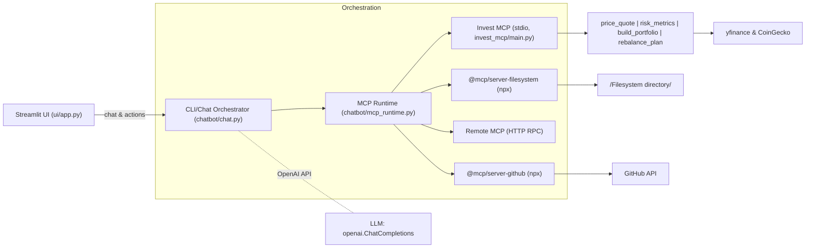

# Redes-pry1 — MCP Chat + Investment MCP (Demo)

## Overview

This repository is a working demo that orchestrates multiple **Model Context Protocol (MCP)** servers from Python. It provides:

* A **CLI chat** and a **Streamlit UI** that let you trigger MCP tools via simple `!fs`, `!gh`, `!local`, and `!invest` commands.
* A local **Investment MCP server** (stdio) offering tools for quick quotes, risk metrics, portfolio construction, and rebalance planning, with live data where possible and synthetic fallbacks.

At a high level, the app starts a small **fleet** of MCP servers (Filesystem, GitHub, Local HTTP, and the local Invest server) and routes tool calls from the chat/UI to the right server.

## Table of Contents

* [Features](#features)
* [Architecture & Design](#architecture--design)
* [Project Structure](#project-structure)
* [Getting Started](#getting-started)

  * [Prerequisites](#prerequisites)
  * [Quick Start](#quick-start)
* [Configuration](#configuration)
* [Usage](#usage)

  * [CLI Chat](#cli-chat)
  * [Streamlit UI](#streamlit-ui)
  * [MCP Tool Commands](#mcp-tool-commands)
* [API](#api)

  * [Investment MCP Tools](#investment-mcp-tools)
* [Data & Storage](#data--storage)
* [Testing](#testing)
* [Quality & Linting](#quality--linting)
* [Deployment](#deployment)
* [Observability](#observability)
* [Security](#security)
* [Roadmap](#roadmap)
* [Troubleshooting & FAQ](#troubleshooting--faq)
* [Contributing](#contributing)
* [License](#license)
* [Acknowledgments](#acknowledgments)
* [Assumptions & TODOs](#assumptions--todos)

## Features

* **Chat-driven MCP orchestration** (`chatbot/chat.py`): parse `!fs/!gh/!local/!invest` lines, send them to the right MCP server, and show results.
* **Streamlit UI** (`ui/app.py`): friendly UI with quick actions for Filesystem, GitHub commits, and investment tools.
* **Local Investment MCP server** (`invest_mcp/…`): stdio JSON‑RPC with tools:

  * `price_quote`: last price + returns (1d/7d/30d) using yfinance/CoinGecko with synthetic fallback
  * `risk_metrics`: annualized mean/volatility/Sharpe
  * `build_portfolio`: simplified long‑only Markowitz allocation
  * `rebalance_plan`: suggested trades to reach target weights
* **External MCP servers** via `npx`:

  * `@modelcontextprotocol/server-filesystem`
  * `@modelcontextprotocol/server-github`
* **Logging & caching**: JSONL logs in `logs/`, data cache in `.cache/invest_mcp/`.

## Architecture & Design



**Key decisions & trade‑offs**

* **MCP stdio vs HTTP**: Filesystem/GitHub servers run via stdio (`npx …`), while the `local` connector uses HTTP JSON‑RPC if `REMOTE_MCP_URL` is set. This keeps local dev simple while allowing remote MCPs.
* **Live data with fallback**: Investment tools try live data (yfinance/CoinGecko) with caching; if unavailable, synthetic series keep the tools functioning for demos and offline use.
* **Simple gradient optimizer** (portfolio): a lightweight projected‑simplex gradient descent avoids extra solver dependencies.
* **JSONL logs**: minimal operational breadcrumbs without external observability systems.

## Project Structure

```
└── diegoval-dev-redes-pry1/
    ├── README.md
    ├── requirements.txt
    ├── chatbot/
    │   ├── chat.py               # CLI chat orchestrator
    │   ├── config.py             # env vars & paths
    │   ├── llm.py                # OpenAI client wrapper
    │   └── mcp_runtime.py        # Start/route to MCP servers (stdio & HTTP)
    ├── demo/
    │   └── mcp_github.txt        # Sample text
    ├── Filesystem/               # Default FS root for filesystem MCP
    │   ├── hola.txt
    │   └── test.txt
    ├── host/
    │   └── mcp_host_stdio.py     # Minimal MCP stdio host helper
    ├── invest_mcp/               # Local MCP server (stdio)
    │   ├── main.py               # Entrypoint: run_stdio_loop()
    │   ├── protocol.py           # MCP request router & tool dispatch
    │   ├── transport_stdio.py    # stdio loop
    │   ├── lib/
    │   │   └── data_live.py      # yfinance/CoinGecko + caching utilities
    │   └── tools/
    │       ├── data.py           # synthetic universe & series
    │       ├── price_quote.py    # quotes & short-term returns
    │       ├── risk_metrics.py   # mean/vol/Sharpe
    │       ├── build_portfolio.py# long-only Markowitz demo
    │       └── rebalance_plan.py # suggested trades
    └── ui/
        └── app.py                # Streamlit front-end
```

## Getting Started

### Prerequisites

* **Python**: 3.9+ recommended
* **Node.js & npx**: required to launch the Filesystem & GitHub MCP servers
* **Accounts/keys**:

  * **OpenAI API key** (required): `OPENAI_API_KEY`
  * **GitHub token** (optional): `GITHUB_PERSONAL_ACCESS_TOKEN` / `GITHUB_TOKEN` / `GH_TOKEN`
  * **CoinGecko** (optional): `COINGECKO_PRO_API_KEY` or `COINGECKO_API_KEY` (demo)

### Quick Start

```bash
# 1) Clone and enter
git clone https://github.com/Diegoval-Dev/Redes-pry1
cd Redes-pry1

# 2) Python env & deps
python -m venv .venv
source .venv/bin/activate  # Windows: .venv\Scripts\activate
pip install -r requirements.txt

# 3) Environment (required: OPENAI_API_KEY)
cat > .env << 'EOF'
OPENAI_API_KEY=sk-your-key
# Optional extras
# GITHUB_PERSONAL_ACCESS_TOKEN=ghp_...
# FS_ROOT=/absolute/path/to/Filesystem
# REMOTE_MCP_URL=http://localhost:8000   # if you have a remote MCP over HTTP
# COINGECKO_PRO_API_KEY=...
# COINGECKO_API_KEY=...
EOF

# 4a) Run the Streamlit UI
streamlit run ui/app.py

# 4b) Or run the CLI chat
python -m chatbot.chat
```

> On first run, the app will start the MCP servers: filesystem, github (via `npx`), a remote HTTP MCP if configured, and the local `invest_mcp` stdio server.

## Configuration

All configuration can be provided via environment variables (recommended: a local `.env` file).

| Name                                                         | Type   |                      Default | Required | Description                                                                             |
| ------------------------------------------------------------ | ------ | ---------------------------: | :------: | --------------------------------------------------------------------------------------- |
| `OPENAI_API_KEY`                                             | string |                            — |     ✅    | OpenAI API key used by `chatbot/llm.py`.                                                |
| `GITHUB_PERSONAL_ACCESS_TOKEN` / `GITHUB_TOKEN` / `GH_TOKEN` | string |                            — |     ❌    | Token used by the GitHub MCP server for higher rate limits.                             |
| `FS_ROOT`                                                    | path   |          `<repo>/Filesystem` |     ❌    | Root directory exposed by the Filesystem MCP server. Created if missing.                |
| `CHAT_LOG_DIR`                                               | path   |                       `logs` |     ❌    | Directory for JSONL chat and MCP logs.                                                  |
| `REMOTE_MCP_URL`                                             | URL    |                            — |     ❌    | Base URL for a remote MCP over HTTP JSON‑RPC. If set, `local-remote` client is enabled. |
| `REMOTE_MCP_PATH`                                            | path   |                       `/rpc` |     ❌    | RPC path appended to `REMOTE_MCP_URL`.                                                  |
| `MCP_LOG_FILE`                                               | path   | `logs/invest_mcp_server.log` |     ❌    | Log file for the local Invest MCP server.                                               |
| `MCP_LOG_LEVEL`                                              | enum   |                       `INFO` |     ❌    | Log level for the Invest MCP server (`INFO`/`DEBUG`/`ERROR`).                           |
| `INVEST_MCP_CACHE_DIR`                                       | path   |          `.cache/invest_mcp` |     ❌    | Cache directory for live data.                                                          |
| `INVEST_MCP_DEBUG`                                           | bool   |                          `0` |     ❌    | Enable verbose logging in `data_live.py`.                                               |
| `COINGECKO_PRO_API_KEY`                                      | string |                            — |     ❌    | Auth for CoinGecko Pro API (preferred).                                                 |
| `COINGECKO_API_KEY`                                          | string |                            — |     ❌    | Demo key for public CoinGecko API.                                                      |

## Usage

### CLI Chat

Run:

```bash
python -m chatbot.chat
```

You’ll see a panel with example commands. Type `exit` to quit. The assistant can also suggest commands, which will auto‑execute and summarize results.

### Streamlit UI

Run:

```bash
streamlit run ui/app.py
```

The sidebar includes quick actions for common investment queries and for listing the Filesystem root or GitHub commits.

### MCP Tool Commands

Commands are single lines starting with a prefix and a JSON payload:

* Filesystem:

  ```text
  !fs {"tool":"list_directory","args":{"path":"/absolute/path","recursive":false}}
  ```
* GitHub commits:

  ```text
  !gh {"tool":"list_commits","args":{"owner":"Diegoval-Dev","repo":"Redes-pry1","sha":"main","per_page":3}}
  ```
* Local HTTP MCP (example tool name):

  ```text
  !local {"tool":"json_validate","args":{"blob":"{\"hello\":123}"}}
  ```
* Investment tools:

  ```text
  !invest {"tool":"price_quote","args":{"symbols":["BTC","ETH","SPY","GLD"],"useLive":true}}
  !invest {"tool":"risk_metrics","args":{"symbols":["SPY","QQQ","GLD","BTC"],"riskFree":0.02,"lookbackDays":252,"useLive":true}}
  !invest {"tool":"build_portfolio","args":{"capital":10000,"riskLevel":3,"allowedSymbols":["SPY","QQQ","GLD","BTC","ETH"],"useLive":true}}
  ```

## API

### Investment MCP Tools

All tools return both a textual `content` entry and a `structuredContent` JSON payload.

* **`price_quote`** (`invest_mcp/tools/price_quote.py`)

  * **Input**: `{ symbols: string[], useLive?: boolean, days?: number }`
  * **Output**: `{ quotes: Array<{symbol,name,last,ret1d,ret7d,ret30d,currency,source}>, dataSource: "live"|"synthetic"|"mixed" }`

* **`risk_metrics`** (`invest_mcp/tools/risk_metrics.py`)

  * **Input**: `{ symbols: string[], riskFree?: number, lookbackDays?: number, useLive?: boolean }`
  * **Output**: `{ metrics: Array<{symbol, meanAnnual, volAnnual, sharpe}> }`

* **`build_portfolio`** (`invest_mcp/tools/build_portfolio.py`)

  * **Input**: `{ capital: number, riskLevel: 1..5, horizonMonths?: number, allowedSymbols?: string[], useLive?: boolean }`
  * **Output**: `{ targetWeights: {symbol,weight}[], allocations: {symbol,amount}[], expectedAnnualReturn?: number, volAnnual?: number, sharpe?: number }`

* **`rebalance_plan`** (`invest_mcp/tools/rebalance_plan.py`)

  * **Input**: `{ current: {symbol,amount}[], targetWeights: {symbol,weight}[] }`
  * **Output**: `{ totalCurrent: number, targetAmounts: {symbol,targetAmount,lastPrice}[], trades: {symbol,action,delta}[] }`

## Data & Storage

* **Logs**: JSONL files in `logs/`, e.g. `logs/chat_host.jsonl`, `logs/mcp_invest.jsonl`, and `logs/invest_mcp_server.log`.
* **Cache**: `.cache/invest_mcp/*.json` for live data responses (yfinance/CoinGecko). TTL varies by call (30–600s).
* **Filesystem root**: defaults to `<repo>/Filesystem` but can be overridden with `FS_ROOT`.

## Testing

No automated tests or CI workflows are present in the repository.

## Quality & Linting

No linters/formatters or pre-commit configs are present in the repository.

## Deployment

Local execution only. No Docker/K8s manifests are included.

## Observability

* Investment MCP server logs to `logs/invest_mcp_server.log` and stderr.
* The `chatbot/mcp_runtime.py` logs MCP JSON traffic under `logs/` (per server).

## Security

* **Secrets**: Keep `OPENAI_API_KEY`, GitHub, and CoinGecko keys in `.env` (never commit). The app reads with `python-dotenv`.
* **Network**: Live data calls hit yfinance and CoinGecko. Consider rate limits and API key policies.

## Roadmap

* Optional: add unit tests for tool logic (portfolio optimizer, metrics).
* Optional: Dockerize the stack for reproducible runs.
* Optional: add CI (lint, tests) and pre-commit hooks.

## Troubleshooting & FAQ

* **`Falta OPENAI_API_KEY en .env`** at startup

  * Create `.env` with `OPENAI_API_KEY=...` and rerun.
* **`Failed starting MCP server 'filesystem'` / `npx` not found**

  * Install Node.js and ensure `npx` is in `PATH`.
* **`HTTP ... at REMOTE_MCP_URL` errors**

  * Verify `REMOTE_MCP_URL` is reachable and the server speaks MCP JSON‑RPC at `/rpc` (or set `REMOTE_MCP_PATH`).
* **Investment live data returns empty**

  * It falls back to synthetic data. Check internet access and optional CoinGecko keys for rate‑limit relief.
* **GitHub commits tool shows errors or is rate‑limited**

  * Provide a GitHub token in `.env` to raise limits.

## Contributing

Open a PR with focused changes. Keep the README accurate: do not document features that aren’t in the code.

## License

**Unknown** — no license file detected.

## Acknowledgments

* [Model Context Protocol](https://modelcontextprotocol.io/) servers used via `npx`:
  `@modelcontextprotocol/server-filesystem`, `@modelcontextprotocol/server-github`.
* yfinance and CoinGecko for market data; Streamlit for the UI; Rich for CLI output.

## Assumptions & TODOs

* **Project metadata** (name, status, license, maintainers) not provided. Document when known.
* **CI/coverage/docs links** absent. Add when available.
* **Remote MCP** endpoint (`REMOTE_MCP_URL`) is optional and not included in this repo.
* **Python version support** is inferred; no explicit toolchain/pin provided.
* **No tests**: add unit tests for portfolio/risk logic and MCP transport.

<!--
Auto-generated notes:
- README generated from repository contents. No external claims added.
- Keep section order per template. Update badges/links once CI, license, and docs exist.
-->
